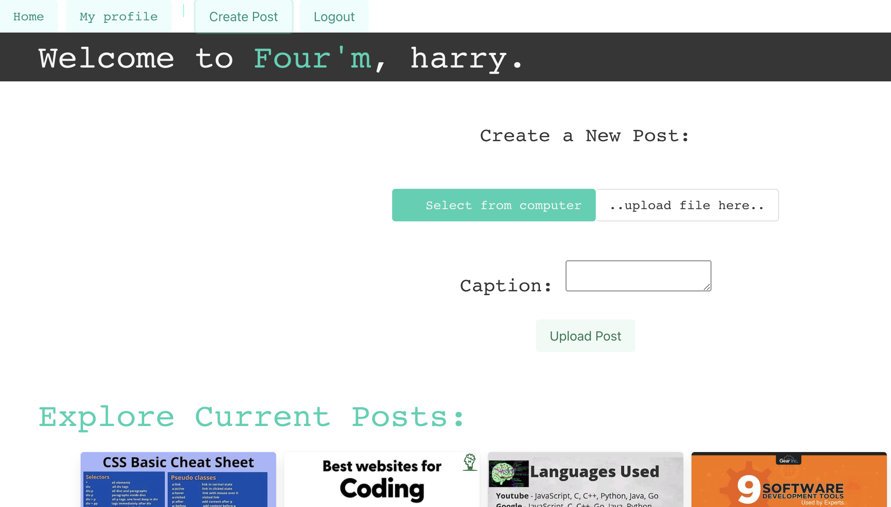

# four-m
four'm (pronounced 'forum') is a picture-board design tech forum, an interactive full-stack app for fellow engineers and tech enthusiasts to connect, share ideas and newest technology and essentially create their own profile board from inspirations.

## Our Team

### **Tina Wang** ###
> GitHub [@tunaabop](https://github.com/tunaabop) &nbsp;&middot;&nbsp;
### **Esteban Alcala** ###
> GitHub [@EAlcala92](https://github.com/EAlcala92) &nbsp;&middot;&nbsp;
### **Jacob Alvarado** ###
> GitHub [@Sonek0](https://github.com/Sonek0) &nbsp;&middot;&nbsp;
### **Sophia Ruiz** ###
> GitHub [@sophiaaruiz](https://github.com/sophiaruiz) &nbsp;&middot;&nbsp;

## User Story
AS A new developer, I want a app where I can see and save posts by other developers to increase my knowledge and be able to collaberate.
AS A new developer, I want a app where I can see and save posts, as well as creating and sharing my boards with other developers in a fun social-media based yet informational manner
SO THAT I can increase my knowledge of new tech advances in software and hardware.
SO THAT I can collaberate, gain experiences, and build a social network with other developers.

## Wireframe




## Key Features
### Main Page
-   When user visits the main page, they are taken to the #Explore page with all added ideas
-   When a user sees a post, they are able to save it to one of their existing boards or a new one they create
-   When a user visits the main page, they are able to create an account and/or login
-   When the user is logged in, they can create a post from clicking a button in the main page that takes them to another page to create post

### Create Post
-   When a user clicks “Create Post”, they are taken to the create post page. 
-   When a user visits the create post page, they are able to upload a picture and write a caption by typing in the included text box.
-   When the user clicks “Post”, the picture is published to the explore page.
-   When the user visits their posts page, they are able to see their newest post at the top of the page.
-   How to review a post to make sure it is tech-related? (future dev)
    -   Report function – verify picture and caption (future dev)
    -   User guideline (future dev)

### User Profile
-   When user visits their profile page, they see a layout of list of all boards (think about private vs. public boards in the future) they create and are able to CRUD (create, access, update, and delete) multiple boards with different names
-   When a user visits their profile page, they see a default board that contains all the posts they have created.
-   When a user visits their profile page, they can see a list of accounts they follow and can visit their pages by clicking on their account
    -   CRUD feature for user’s following list
        -   User can follow an account on the account’s profile page
        -   They can see a list of accounts they follow and can visit their pages by clicking on their account
        -   User can unfollow from either their following list or the other account’s profile page
-   “Open to collaborate” feature on/off and allows other users to see if switch is on
-   Option to add Github username 

## How To Use

To clone and run this application, you'll need VS installed on your computer. From your command line:

```bash
# Clone this repository
$ git clone git@github.com:tunaabop/four-m.git
# Go into the repository
$ cd four-m
# Install dependencies
$ npm install
# Run the app
$ npm start
```
